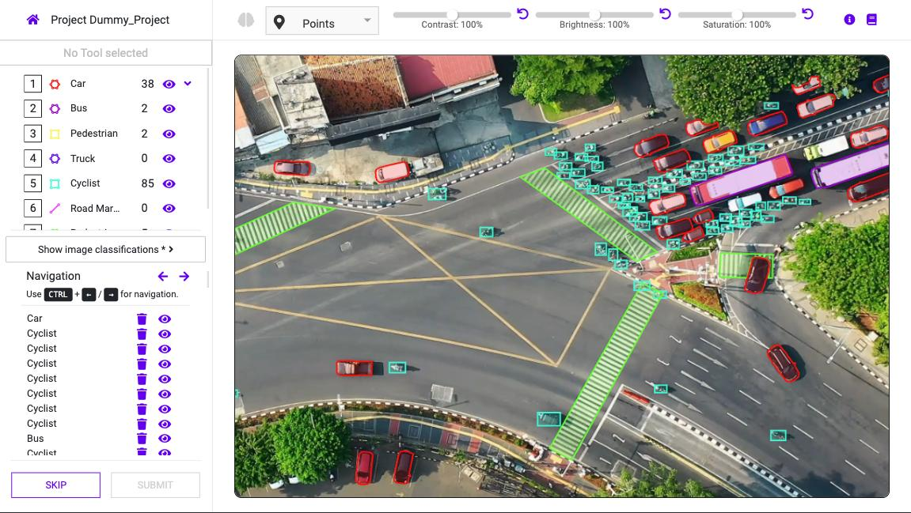

# DataGym.ai

DataGym.ai is a modern, web based workbench to label images and videos. 
It allows you to manage your projects and datasets, label data, control quality and build your own training data pipeline.
With DataGym.ai´s API and Python SDK you can integrate it into your toolchain.



## Ressources
- Website: <https://www.datagym.ai/>
- Documentation: <https://docs.datagym.ai/documentation/>

## Features

- Organize your data into different projects with tasks
  - Dashboard with useful statistics / overview
  - Tasks lifecycle with states (backlog, waiting, in progress, completed, skipped, reviewed)
  - Pagination, Filtering and Search
  - Integrated quality control / review process
- Organize your media within datasets
    - Different storage types (direct upload, public url´s, aws s3 cloud storage)
    - Supported mime types: jpeg, png, mp4
    - Support of large high resolution images
- Labeling features
  - **Global classifications (image wide)**
  - **Image annotation**
    - Variety of geometries: point, line, bounding box, polygons
    - Different classification types: text, checklists, option-box
    - Supports nested geometries (child-geometries)
  - **Video annotation: Specialized editor for video labeling**
      - Frame-by-frame navigation
      - Linear interpolation to track objects
      - Adjustable playback-speed
      - Analyze and extract video metadata (codec, framerate, duration, ...)
  - **Image segmentation**
    - Bitmap export
- Feature-rich Workspace
  - Temporary screen manipulations: contrast, brightness, saturation
  - Hide unused geometry-groups for more clarity
  - Shortcut support
  - Panning and zooming, multi-select, moving, duplication
  - Supports transformation of the same geometry type
  - Context menu for geometries
- Powerful **REST API** to build your own workflows
  - Python SDK Package
- Data exporting- and importing (json)
  - Export your labeled data as json (works for images and videos)
  - Import your labeled data to refine your ml model
  - Export-/import your label configuration and use it in multiple projects


## Quickstart

### Running with docker-compose
The simplest way to run DataGym.ai locally is by using docker-compose.

1. Download the `docker-compose.yml` from the projects root-directory
   - <https://raw.githubusercontent.com/datagym-ai/datagym-core/master/docker-compose.yml>
   - `wget https://raw.githubusercontent.com/datagym-ai/datagym-core/master/docker-compose.yml`
2. Launch container using `docker-compose up -d`
3. Wait until the initialization is done
4. Navigate to `localhost:8080`


### Local development, build manually
Build the whole project:
```sh
mvn clean install 
```


## Build with

- Java / Spring Boot
- Angular

## Contributing
We would love to receive contributions and are currently preparing our _Contribution Guide_ for more details.

## License

This project is licensed under the MIT License - see the [LICENSE](LICENSE) file for details